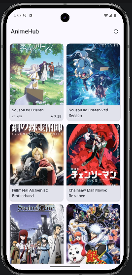
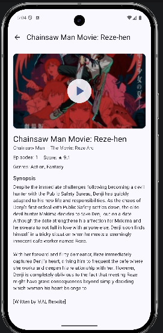

# AnimeHub

Android app to browse top anime and view details with trailers. Built with **Kotlin**, **Jetpack Compose**, and **Clean Architecture**.

## Screenshots

| List – top anime grid | Detail – trailer, synopsis, metadata |
|-----------------------|--------------------------------------|
|  |  |

## Demo Video

[Watch demo](demo/demo-video.mp4)

<video src="demo/demo-video.mp4" controls width="400"></video>

## Highlights

- **Offline-first** — Cached data when offline; auto-sync when back online; “You’re offline” on refresh
- **Clean Architecture** — `data` / `domain` / `presentation` with repository, use cases, and sealed UI state
- **Single source of truth** — Room DB; UI reads from Flows; API refreshes/populates DB
- **In-app trailer** — YouTube trailers play inside the detail screen (no redirect)
- **Modern stack** — Compose, Material 3, Koin, Retrofit, kotlinx.serialization, Coil

## Tech Stack

| Layer     | Libraries |
|----------|------------|
| UI       | Jetpack Compose, Material 3, Navigation Compose |
| DI       | Koin (one module, no code gen) |
| Networking | Retrofit, OkHttp, kotlinx.serialization |
| Local    | Room, Flow |
| Images   | Coil |
| Video    | Android YouTube Player (in-app trailers) |
| Async    | Kotlin Coroutines, StateFlow, SharedFlow |

## Structure

```
app/
├── data/         # Remote (Retrofit, DTOs), local (Room), mappers, repository impl
├── domain/       # Model, AnimeRepository interface, use cases (GetTopAnime, GetAnimeDetail)
├── presentation/ # UiState, ViewModels, ui/ (screens, navigation, theme), MainActivity
└── di/           # Koin appModule
```

## Features

- **List:** Top anime grid (poster, title, episodes, score), pull-to-refresh, offline cache, online indicator; empty state “No anime found”
- **Detail:** Poster/trailer (play in-app), synopsis, genres, cast; works offline if previously loaded
- **Offline-first:** Show cache when offline; sync when network returns

## API

[Jikan API v4](https://jikan.moe/) (no key required):

- `GET /v4/top/anime` — top anime list
- `GET /v4/anime/{id}` — anime detail (incl. trailer)
- `GET /v4/anime/{id}/characters` — main cast

## 📦 APK Download

You can download and test the app here:

[Download APK](apk/app-debug.apk)

## Build & Run

- **Min SDK:** 26 · **Target SDK:** 36  
- Open in Android Studio and run on device/emulator.

```bash
./gradlew assembleDebug
```
